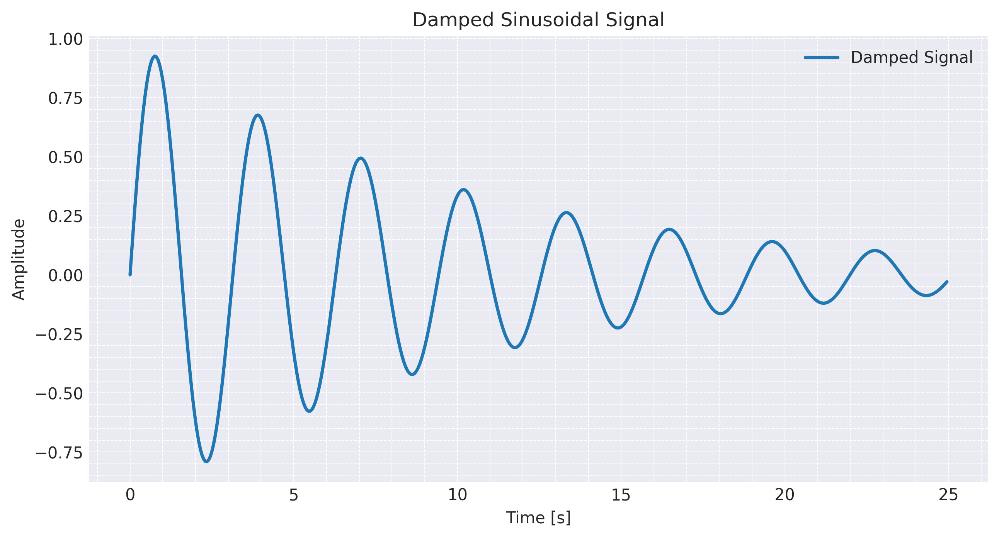
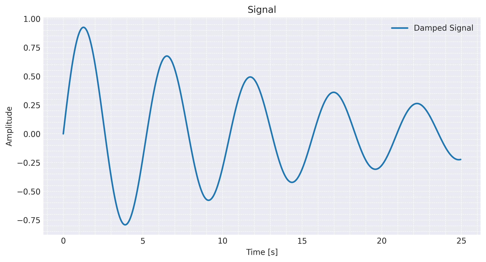

## Mathematical Concept

The signal is defined as:

$$
x(t) = e^{-\alpha t} \cdot \sin(\omega t)
$$

---
### Components

- **Sinusoidal component**  
  sin(ωt)  
  - Represents periodic oscillation  
  - ω is the angular frequency (rad/s)  

- **Exponential decay**  
  e^(-αt)  
  - Controls amplitude reduction over time  
  - α is the damping coefficient  
---

### Interpretation

- At $t = 0$, the signal starts with maximum amplitude  
- As time increases, the exponential term reduces the amplitude  
- The signal continues oscillating while gradually fading  

This type of signal appears in:

- mechanical vibrations  
- electrical circuits (RLC)  
- control systems  

---

## Implementation

- C for real-time signal generation  
- Python (Matplotlib) for reading and plotting data  
- A Makefile for automation  

---

### C Program (`signal.c`)

- Computes:
  - exponential decay using `exp()`  
  - sinusoidal oscillation using `sin()`  
- Outputs values continuously using `printf`  
- Uses:
  - fixed time step: `STEP`  
  - delay: `usleep()`  
- Flushes output (`fflush`) for real-time streaming  

---

### Python Script (`plot.py`)

- Starts the C executable using `subprocess`  
- Reads signal values line-by-line  
- Stores:
  - amplitude values  
  - corresponding time values  
- Uses Matplotlib to:
  - plot the signal  
  - save the image as `damped.png`  

---

## Notes

- `alpha` controls the damping speed  
- `omega` controls the oscillation frequency  
- `STEP` and `DELAY` control the sampling resolution  

---

### Makefile

- Compiles the C program  
- Runs the Python script  

Commands:

```bash
make
make clean
```
---

### Results

The resulting plot represents a sinusoidal signal with exponentially decreasing amplitude.

- The waveform oscillates sinusoidally  
- The amplitude decreases over time due to exponential damping  




